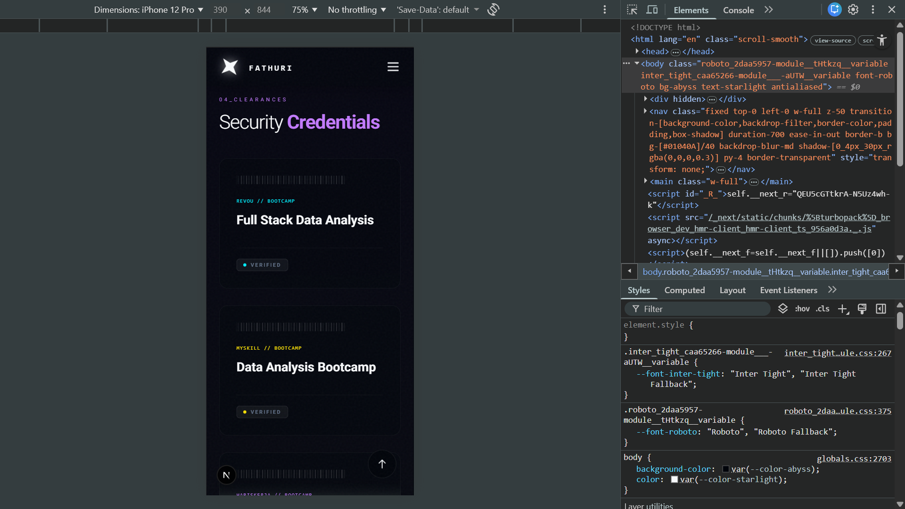

# 🌐 Portfolio_OS // Cyberpunk Analytics Terminal

## 🚀 Overview
Standard resumes and traditional portfolios lack the visceral, interactive depth necessary to truly showcase a technical skillset. **Portfolio_OS** is a high-performance, cyberpunk-themed digital terminal designed to translate complex HR analytics and automation engineering into tactical, visual clarity.

Built with **Next.js, Tailwind CSS, and Framer Motion**, this project serves as both a central hub for my data engineering projects and a live technical demonstration of modern frontend architecture.

---

## ✨ System Features
* **Extreme Cyberpunk Aesthetic:** Dark mode native, featuring neon glows, custom pulse animations, and deep abyss gradients to keep users visually engaged.
* **Tactile Interactivity:** Heavily utilizes Framer Motion and Tailwind hover states to create a responsive, software-like feel rather than a static webpage.
* **Dynamic Data Rendering:** Project architectures, tech stacks, and detailed image carousels are rendered dynamically from a central JSON architecture, allowing for instant scalability as new projects are added.
* **Mobile-First Responsiveness:** Features custom React hooks to handle touch states, scroll transparency, and perfect flexbox scaling across any device size.

---

## 📸 Interface Showcase

### 1. The Interactive UI
Tactile hover states and dynamic gradients guide the user's eye directly to the project architecture.

### 2. Mobile Terminal
Flawless vertical scaling ensures the terminal is fully operational and visually striking on any mobile device.

---

## 🛠️ Tech Stack
* **Framework:** Next.js (React)
* **Styling:** Tailwind CSS (Custom neon configurations, complex gradients)
* **Animation:** Framer Motion (Page transitions, dynamic mounting)
* **Deployment:** Vercel 

---

## ⚙️ Initialization
To boot the terminal locally:
1. Clone this repository.
2. Install dependencies: `npm install`
3. Start the development server: `npm run dev`
4. Access the mainframe at `http://localhost:3000`